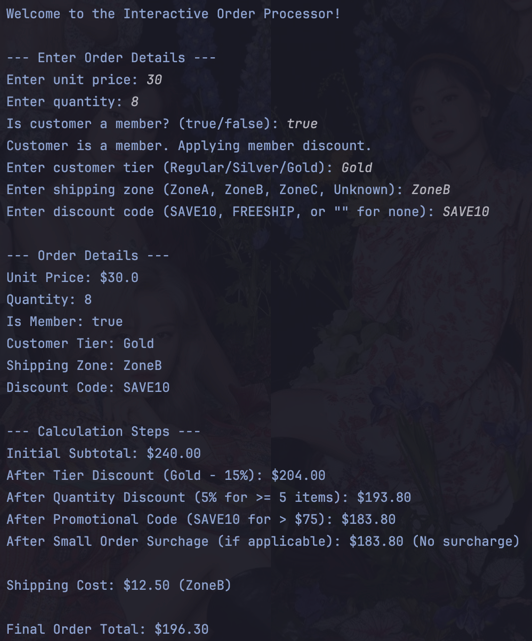
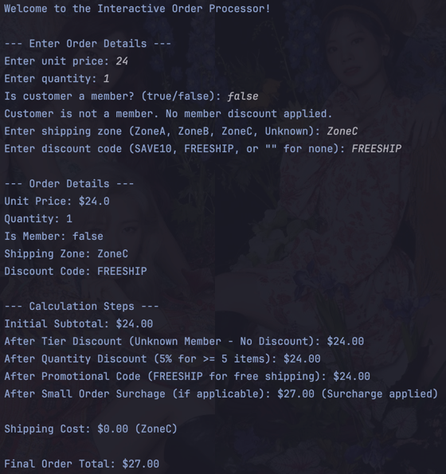
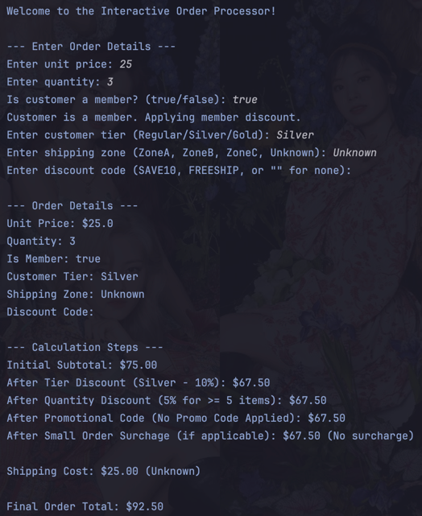
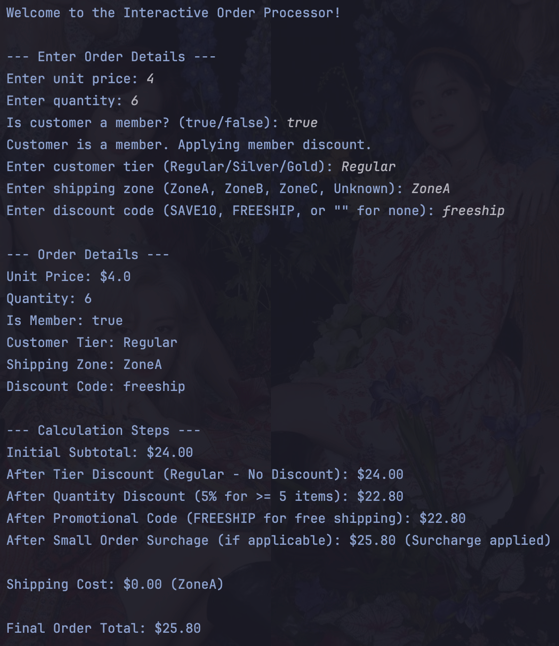
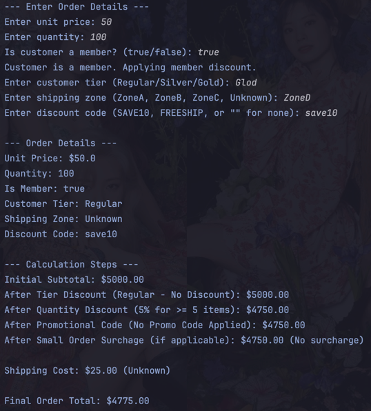
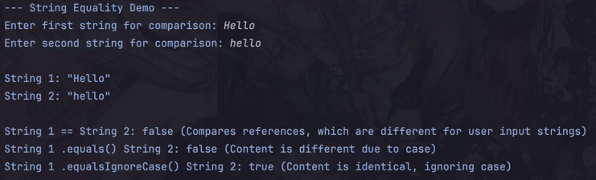
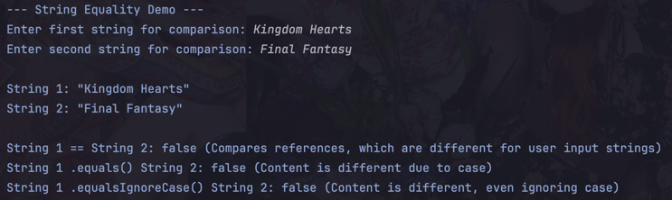
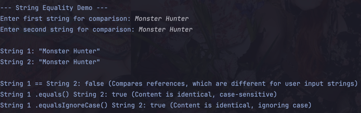

# Lab: Using Operators and Design Construct

## Warren Denzel F. Cheng

### Description: 
This lab demonstrates the use of operators and design constructs in a simple interactive order processing system. The system allows users to input their orders, calculates the total cost, and provides feedback based on the order details. 
It also involves exploring string equality logic.

### Interactive Order Processor
Sample Output:  

Sample Output 2:  

Sample Output 3:  

Sample Output 4:  

Sample Output 5:  

### String Equality Demo
Sample Output:  

Sample Output 2:  

Sample Output 3:  

